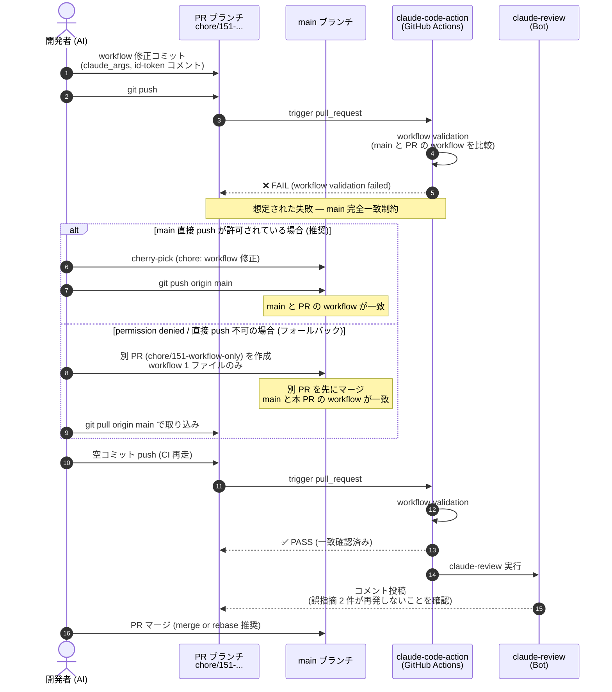

# シーケンス設計

本 Issue はランタイム処理フローの変更ではなく、**workflow の安全反映プロセス**を扱う。
そのため、コードのシーケンスではなく **PR マージまでの workflow 変更フロー**を Mermaid で記述する。

## workflow 変更の安全反映フロー

## 補足

- 認証: `id-token: write` 権限で OIDC → GitHub App token 交換（変更後も同じ挙動）
- 副作用: 本 Issue ではなし。ランタイムロジック未変更
- 失敗時の戻し方: workflow を main の元の状態に戻す revert PR を作成すれば即座に復旧
- main 直接 push 制約: harness の permission rule で禁止される場合があるため、permission の遅延評価で拒否される可能性に注意。事前にユーザー許可を取る。拒否時はシーケンス図の `else` 分岐（別 PR 戦略）に切り替える

## マージ方式の注意

cherry-pick + **squash** マージを使うと、同一内容のコミットが main の履歴に 2 つ残ります（cherry-pick 由来のコミット + squash マージコミット）。これを避けるため:

- **推奨**: マージ方式は **merge** または **rebase** を使う
- **squash を使う場合**: 別 PR 戦略（`else` 分岐）を選ぶ。cherry-pick が不要になるため履歴が綺麗になる

GitHub の PR マージ画面で「Create a merge commit」「Rebase and merge」「Squash and merge」のうち、本 Issue では**前者 2 つ**を推奨。
