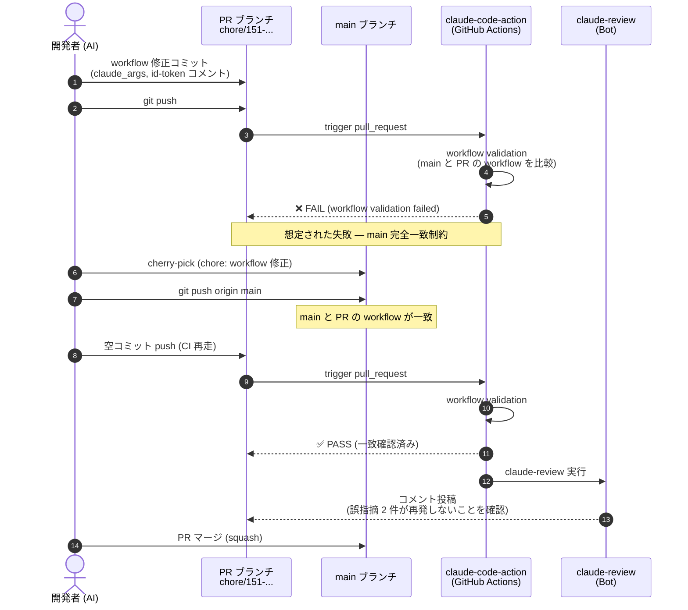

# シーケンス設計

本 Issue はランタイム処理フローの変更ではなく、**workflow の安全反映プロセス**を扱う。
そのため、コードのシーケンスではなく **PR マージまでの workflow 変更フロー**を Mermaid で記述する。

## workflow 変更の安全反映フロー

## 補足

- 認証: `id-token: write` 権限で OIDC → GitHub App token 交換（変更後も同じ挙動）
- 副作用: 本 Issue ではなし。ランタイムロジック未変更
- 失敗時の戻し方: workflow を main の元の状態に戻す revert PR を作成すれば即座に復旧
- main 直接 push 制約: harness の permission rule で禁止される場合があるため、`gh secret list` 風の遅延評価で拒否される可能性に注意。事前にユーザー許可を取る
