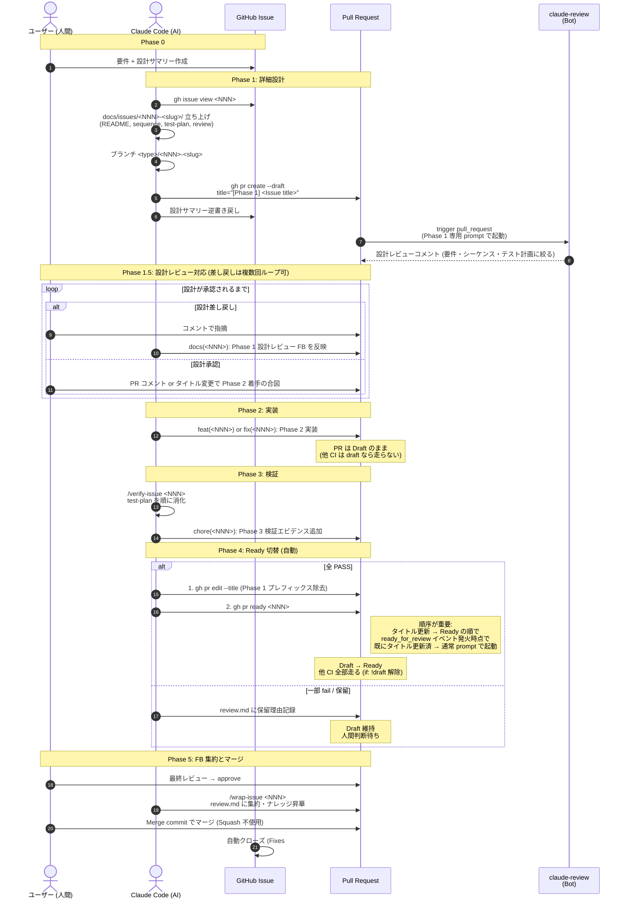
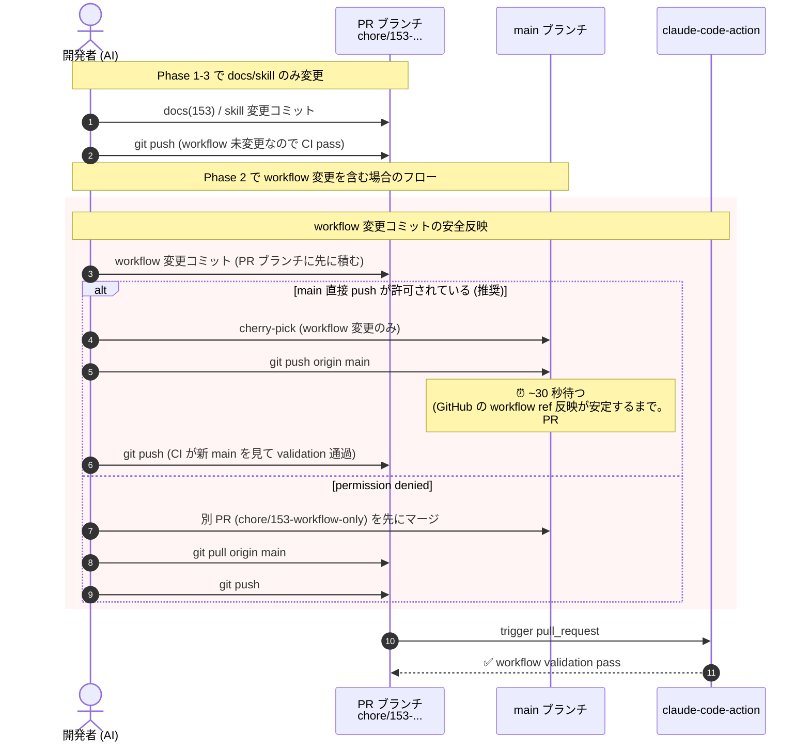

# シーケンス設計

本 Issue はランタイム処理ではなく、**v1 規約から v2 規約への移行**を扱う。
sequence は **v2 サイクルの全体フロー**と **本 PR 自身の workflow 反映フロー**の 2 種類を記述。

## v2 開発サイクル全体フロー



## 本 PR の workflow 反映フロー

本 Issue は workflow 変更を含むため、PR #152 と同様の cherry-pick 戦略を取る。
ただし PR #152 で発見した **タイミング差問題**を踏まえ、`main push → CI 反映待ち → PR push` の順序を明示する。



## 補足

### Phase 4 自動 Ready 切替の判定と実行順序

`/verify-issue` の最終ステップで:

```bash
# 現在の PR タイトルを取得
title=$(gh pr view <PR> --json title -q '.title')

# test-plan.md 内の未チェック項目をカウント (set -e 対策で || true)
unchecked=$(grep -c '^- \[ \]' docs/issues/<NNN>-<slug>/test-plan.md || true)

if [ "$unchecked" = "0" ]; then
  # 必ず「タイトル更新 → Ready 切替」の順序を守る
  # ready_for_review イベントが発火する時点でタイトル更新済 → claude-review が通常 prompt で起動
  gh pr edit <PR> --title "$(echo "$title" | sed 's/\[Phase 1\] //')"
  gh pr ready <PR>
else
  echo "WARN: $unchecked 件未チェック。Draft 維持し review.md に保留理由を記録"
fi
```

**順序の根拠**: `claude-code-review.yml` の trigger は `[opened, synchronize, ready_for_review, reopened]` であり、**タイトル変更 (`edited`) 単体ではトリガーされない**。`gh pr ready` で `ready_for_review` イベントを発火させた時点で **既にタイトルが更新済**であれば、claude-review は通常 prompt（`[Phase 1]` 検出されず）で起動する。タイトル変更を後にすると、prompt 切替のために空コミットが必要になり冗長。

### Bot 応答コミットメッセージのフォーマット

```
docs(<NNN>): Phase 1 設計レビュー FB を反映
feat(<NNN>): Phase 2 実装 - <概要>
fix(<NNN>): Phase 2 実装 - <概要>
chore(<NNN>): Phase 3 検証エビデンス追加
docs(<NNN>): Phase 5 review.md 集約
```

### マージ方式

- **Create a merge commit**: 標準。Phase 別 commit を main 履歴に残す
- **Rebase and merge**: 可。同様に Phase 別 commit が残る
- **Squash and merge**: 不使用。Phase 履歴が消える + cherry-pick との重複の原因
