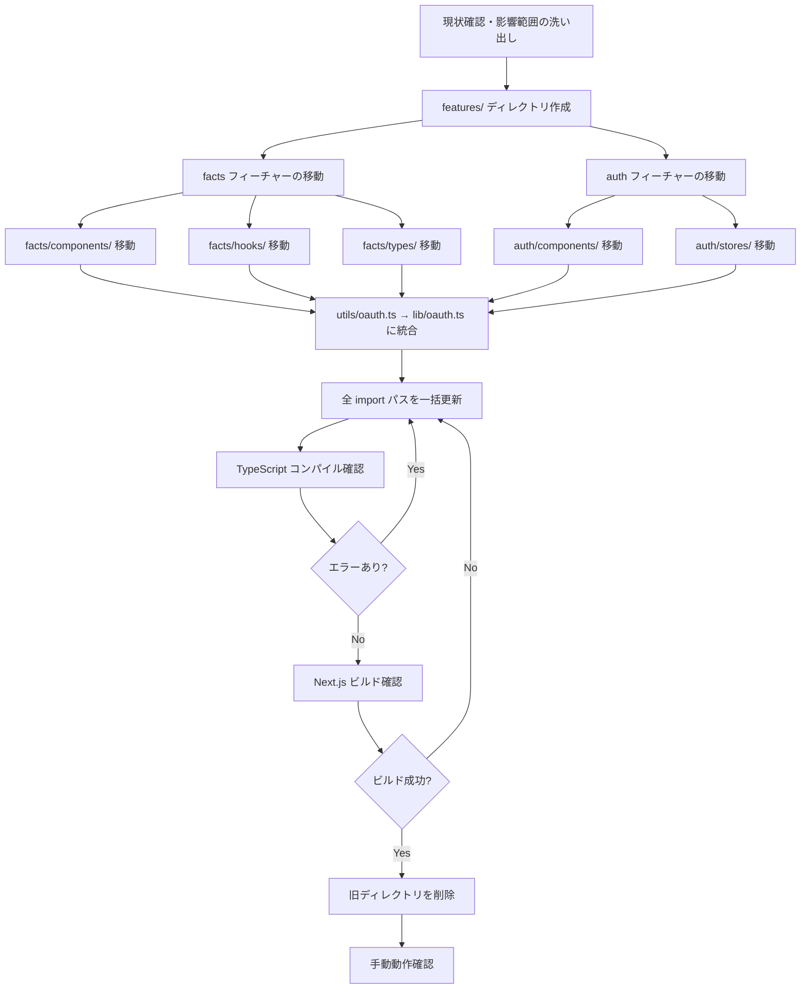

# シーケンス設計

本 Issue はリファクタリング（ファイル移動・import パス更新）のため、動的な処理フローの変更はない。
代わりに **移行手順** と **ファイル移動マッピング** を記述する。

## 移行手順フロー

## ファイル移動マッピング

### components/facts/ → features/facts/components/

| 移動前 | 移動後 |
| --- | --- |
| `src/components/facts/FactCard.tsx` | `src/features/facts/components/FactCard.tsx` |
| `src/components/facts/FactCardEditForm.tsx` | `src/features/facts/components/FactCardEditForm.tsx` |
| `src/components/facts/FactDetailDrawer.tsx` | `src/features/facts/components/FactDetailDrawer.tsx` |
| `src/components/facts/FactFilters.tsx` | `src/features/facts/components/FactFilters.tsx` |
| `src/components/facts/FactMemoInput.tsx` | `src/features/facts/components/FactMemoInput.tsx` |
| `src/components/facts/FactThread.tsx` | `src/features/facts/components/FactThread.tsx` |
| `src/components/facts/DateFilter.tsx` | `src/features/facts/components/DateFilter.tsx` |
| `src/components/facts/DateSeparator.tsx` | `src/features/facts/components/DateSeparator.tsx` |
| `src/components/facts/index.ts` | `src/features/facts/components/index.ts` |
| `src/components/facts/detail/*.tsx` | `src/features/facts/components/detail/*.tsx` |

### hooks/ → features/facts/hooks/

| 移動前 | 移動後 |
| --- | --- |
| `src/hooks/useDateFilter.ts` | `src/features/facts/hooks/useDateFilter.ts` |

### types/ → features/facts/types/

| 移動前 | 移動後 |
| --- | --- |
| `src/types/fact.ts` | `src/features/facts/types/fact.ts` |

### components/auth/ → features/auth/components/

| 移動前 | 移動後 |
| --- | --- |
| `src/components/auth/AuthGuard.tsx` | `src/features/auth/components/AuthGuard.tsx` |

### stores/ → features/auth/stores/

| 移動前 | 移動後 |
| --- | --- |
| `src/stores/authStore.ts` | `src/features/auth/stores/authStore.ts` |

### utils/ → lib/ (統合・廃止)

| 移動前 | 移動後 |
| --- | --- |
| `src/utils/oauth.ts` | `src/lib/oauth.ts` |
| `src/utils/` (空) | 削除 |

## 補足

- 認証: 変更なし（app/ のルーティング構成は変更しない）
- 副作用: import パスの一括更新が必要（`app/` 配下の page.tsx で `@/components/facts`, `@/types/fact`, `@/stores/authStore` 等を参照している箇所）
- 失敗時: TypeScript コンパイルエラーが検出されるため、不整合は即座に発覚する

## 旧ディレクトリ削除対象

ファイル移動後、以下のディレクトリが空になるため削除する:

| 削除対象 | 理由 |
| --- | --- |
| `src/components/facts/` | `features/facts/components/` に全ファイルを移動済み |
| `src/components/auth/` | `features/auth/components/` に全ファイルを移動済み |
| `src/hooks/` | `features/facts/hooks/` に全ファイルを移動済み |
| `src/stores/` | `features/auth/stores/` に全ファイルを移動済み |
| `src/types/` | `features/facts/types/` に全ファイルを移動済み |
| `src/utils/` | `lib/oauth.ts` に統合済み |

> **注意**: `src/components/layout/` は移動しないため削除しない。
