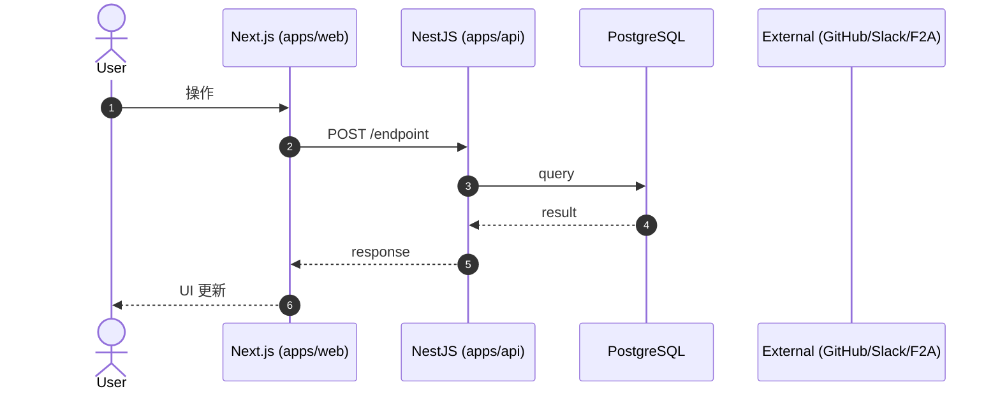

# シーケンス設計

主要な処理フローを Mermaid で記述する。
複数フローがあるなら見出しで分ける（"成功系" / "エラー系" / "リトライ系" など）。

## 全体フロー

## 補足

- 認証: <!-- JWT / Cookie / API Key のどれを使うか -->
- 副作用: <!-- 外部呼び出し、Webhook、Queue など -->
- 失敗時: <!-- リトライ・補償・通知 -->
